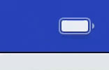
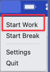
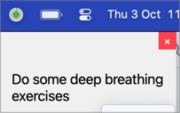
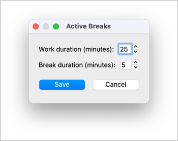

<p align="center">
  
</p>
<h1 align="center">Active Breaks :: Stay Productive, Take Breaks</h1>

ActiveBreaks is a system tray application designed to help users maintain a healthy work-break balance by managing
active breaks during work sessions.

## Motivation

I wanted an application which works like Pomodoro as well as have pre-defined things to do during the break.
The application works in few different modes.

When no task or break is scheduled,
**ActiveBreaks** will automatically start blinking to remind me to stop with distractions and focus on a task.



I can **Start Work** from the context menu.



This will change the indicator, and the indicator will keep track of the timer.


When the break starts after the work timer is completed, a pre-defined activity to do will be displayed.



The break lasts for 5 minutes by default but both the **work** and **break** time is configurable through the "Settings" menu.



## Getting Started

* Install the required dependencies:

```shell
pip install -r requirements.txt
```

* Run the application:

```shell
python main.py
```

* The ActiveBreaks icon will appear in your system tray. Right-click to access the menu and start using the
  application.

## Usage

- Right-click the system tray icon to access the context menu
- Use "Start Work" to begin a work session
- Use "Start Break" to begin a break session (or wait for automatic transition)
- Access "Settings" to customize work and break durations
- Use "Quit" to exit the application

## Contributing

Contributions to ActiveBreaks are welcome! Please feel free to submit pull requests or create issues for bugs and
feature requests.

## License

This project is licensed under the MIT License - see the LICENSE file for details.
